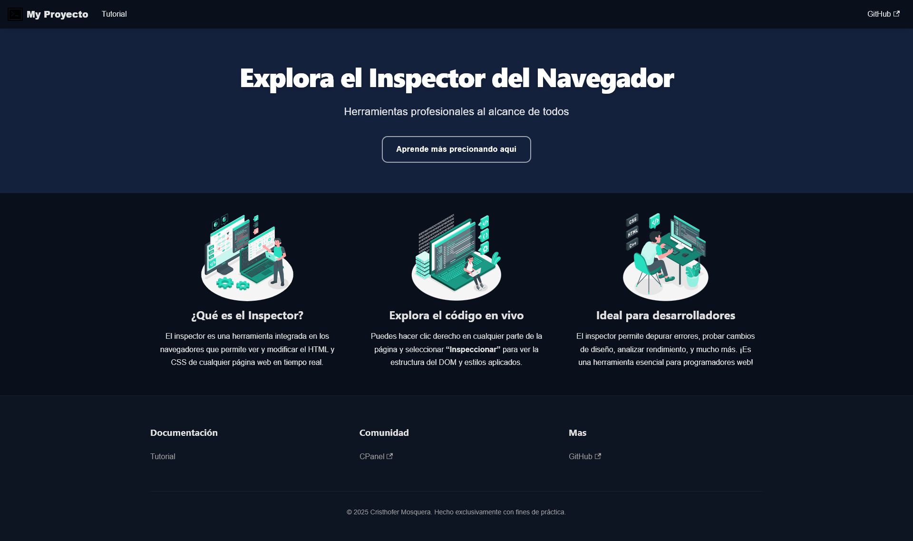

# 📘 Landing Page + Docusaurus: Código Limpio

## 🌐 Landing Page – Venta del libro "Código Limpio"

Este proyecto es una **Landing Page desarrollada en HTML, Bootstrap y CSS puro**, creada para promocionar y vender el reconocido libro _Código Limpio_. El diseño busca ser limpio, atractivo y directo al punto, mostrando de forma clara los beneficios del libro para captar la atención del usuario.

🔗 Puedes verla desplegada en línea desde este enlace:  
[https://933808203.facturalo.co/](https://933808203.facturalo.co/)

---

## ☁️ Despliegue en CPanel

El proyecto fue subido y desplegado con éxito en un hosting mediante **CPanel**, utilizando las herramientas de gestión de archivos del panel. Este proceso permite visualizar el proyecto en un entorno web real, facilitando el acceso desde cualquier navegador.

---

## 📚 Documentación técnica con Docusaurus

Además de la landing page, el mismo proyecto incluye un sitio de documentación técnica generado con **Docusaurus**, una herramienta moderna para construir documentación. Este sitio está alojado bajo la misma ruta del dominio, en la carpeta `/docusaurus`.

🔗 Accede aquí:  
[https://933808203.facturalo.co/docusaurus/](https://933808203.facturalo.co/docusaurus/)

### 📝 Características del sitio Docusaurus:

#### 🛠️ Levantamiento del proyecto
- Guía para ejecutar Docusaurus **en local** y desplegarlo correctamente en **CPanel**.

#### 🌐 Dominio personalizado
- Configuración para que el sitio se acceda desde `dominio.com/docusaurus`.

#### 🎨 Personalización de estilos
- Modificaciones visuales para evitar que el sitio luzca como una plantilla genérica de Docusaurus.

#### 📑 Menú lateral con íconos
- Sidebar personalizado con íconos para mejorar la experiencia de navegación.

#### 📖 Contenido disponible:
- **Manual de uso del inspector de elementos**: una guía práctica para entender y utilizar las herramientas de desarrollo del navegador.

---

## 🖼️ Capturas de pantalla

A continuación se muestran imágenes representativas de la landing page y la documentación técnica:

| Landing Page                             | Página Docusaurus                         | Sidebar con íconos                      |
|------------------------------------------|--------------------------------------------|------------------------------------------|
|     |  |     |

> 💡 Las imágenes deben estar dentro de una carpeta llamada `screenshots/` en el mismo repositorio.

---

## 🚀 Tecnologías utilizadas

- HTML5  
- Bootstrap 5  
- CSS personalizado  
- Docusaurus 2  
- CPanel (hosting)
